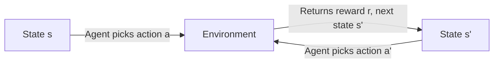
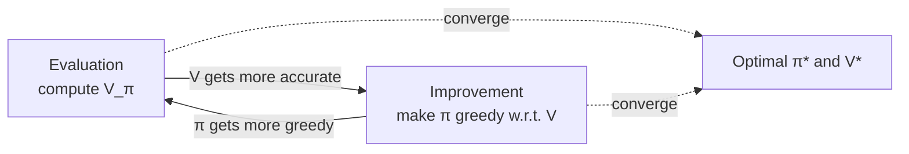
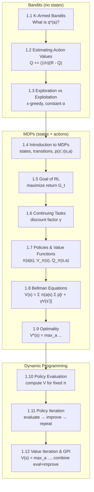

# Chapter 1 — Complete Revision Guide
### Slides 1.1 → 1.12 | Labs 1.1 → 1.4 | Sutton & Barto Chapters 2, 3, 4

> This guide follows the **exact order** of your lecture slides. Each concept builds on the previous one. Read it top to bottom.

---

## The Story in One Paragraph

You start with the **simplest RL problem** — a gambler choosing between slot machines (bandits). There are no "states," just actions and rewards. You learn how to estimate which action is best and how to balance trying new things vs. sticking with what works. Then you level up: the world now has **states** (MDPs). The agent moves between states, and the right action depends on *where you are*. You need a way to say "how good is it to be here?" — that's the **value function**. The **Bellman equation** gives you a recursive formula to compute it. Finally, **Dynamic Programming** uses these equations to find the *best possible* policy when you know everything about the environment.

---

## Topic 1 — The K-Armed Bandit Problem
*Slide 1.1 | Lab 1.1 | Sutton & Barto §2.1*

### The Setup

Imagine 10 slot machines in a row. Each machine has a hidden average payout that you don't know. You get 1000 coins. Each coin lets you pull one machine. Goal: walk away with the most money.

```
Machine:    0     1     2     3     4     5     6     7     8     9
True avg:  0.2  -0.8   1.5   0.3  -1.2   0.7   0.1  -0.5   2.1   0.4
           (you don't know these)
```

### Formal Definitions

| Symbol | Meaning |
|--------|---------|
| `k` | Number of arms (actions). In our labs, `k = 10` |
| `a` | An action (which arm to pull) |
| `R_t` | The reward received at time step `t` |
| `q*(a)` | The **true** expected reward of action `a`: `q*(a) = E[R_t | A_t = a]` |
| `Q_t(a)` | Our **estimate** of `q*(a)` at time `t` |

### What Makes This "RL"?

You don't know `q*(a)`. You must **learn it from experience** — pull arms, observe rewards, update your estimates. This is the essence of RL: learning by interaction.

### In the Lab Code

```python
# In lab_1_1.py — the environment holds the hidden truth
self.true_action_values = np.random.normal(0, 1, num_arms)  # q*(a) drawn from N(0,1)

# When you pull arm 'action', you get a noisy sample:
def get_reward(self, action):
    return np.random.normal(self.true_action_values[action], 1.0)
    # Reward ~ N(q*(action), 1) — truth + noise
```

> **Key point**: Each pull gives you `q*(a) + noise`. One pull alone is unreliable. But average many pulls of the same arm, and the noise cancels out — you converge to `q*(a)`.

---

## Topic 2 — Estimating Action Values
*Slide 1.2 | Lab 1.1 | Sutton & Barto §2.4*

### The Naive Way

Store every reward for every arm, then average them:
```
Q(a) = (sum of all rewards from arm a) / (number of times we pulled arm a)
```

Problem: this requires **storing all past rewards**. Wasteful.

### The Incremental Update (The Important Trick)

We can maintain a *running average* that updates with each new reward:

$$Q_{n+1} = Q_n + \frac{1}{n}\left[R_n - Q_n\right]$$

**Step-by-step derivation** (so you really see why it works):

```
We have:  Q_n = average of first (n-1) rewards
We want:  Q_{n+1} = average of first n rewards

Q_{n+1} = (1/n) × (R₁ + R₂ + ... + R_n)
         = (1/n) × (R_n + R₁ + R₂ + ... + R_{n-1})
         = (1/n) × (R_n + (n-1) × Q_n)          ← the old sum = (n-1) × Q_n
         = (1/n) × R_n + ((n-1)/n) × Q_n
         = (1/n) × R_n + Q_n - (1/n) × Q_n
         = Q_n + (1/n) × (R_n - Q_n)             ← final form!
```

### The General Update Pattern

Every RL update you'll ever see follows this pattern:

$$\boxed{\text{NewEstimate} \leftarrow \text{OldEstimate} + \text{StepSize} \times \left[\text{Target} - \text{OldEstimate}\right]}$$

| Part | What it is | In the formula |
|------|-----------|----------------|
| Old Estimate | What we currently think | `Q_n` |
| Target | What we just observed | `R_n` |
| Error | How wrong we were | `R_n - Q_n` |
| Step Size | How much to correct | `1/n` |

### In the Lab Code

```python
# In lab_1_1.py
def update_value(self, action, reward):
    self.action_counts[action] += 1                          # n
    alpha = 1.0 / self.action_counts[action]                 # step size = 1/n
    self.action_values[action] += alpha * (reward - self.action_values[action])
    #        Q                 += (1/n) * (R     - Q)
```

---

## Topic 3 — Exploration vs. Exploitation Tradeoff
*Slide 1.3 | Labs 1.1 & 1.3 | Sutton & Barto §2.2–2.3*

### The Dilemma

After 50 pulls, you think arm 8 is best (avg reward = 1.9). Do you:
- **Exploit**: Keep pulling arm 8? (maximize short-term reward)
- **Explore**: Try arm 3 which you've only pulled twice? (maybe it's even better)

If you only exploit, you might miss the true best arm. If you only explore, you waste pulls on bad arms.

### Solution: ε-Greedy Policy

```
With probability (1 - ε):  pick the best arm you know      (EXPLOIT)
With probability ε:        pick a random arm                (EXPLORE)
```

- `ε = 0` → pure greedy (never explore) → **Greedy Agent**
- `ε = 0.1` → explore 10% of the time → **ε-Greedy Agent**
- `ε = 1.0` → fully random (never exploit) → terrible

### Tie-Breaking Matters

When multiple arms share the highest Q-value (common at the start when all Q = 0), you must break ties **randomly**. Otherwise the agent is biased toward arm 0.

```python
# WRONG: np.argmax(Q) — always picks the first max
# RIGHT:
max_val = np.max(self.action_values)
ties = np.where(self.action_values == max_val)[0]
action = np.random.choice(ties)
```

### Sample Average vs. Constant Step-Size

This is the **critical distinction** tested in Lab 1.3:

| Method | Step Size | Formula | Behavior |
|--------|-----------|---------|----------|
| **Sample average** | `α = 1/n` | `Q += (1/n)(R - Q)` | All past rewards weighted equally. Good for **stationary** problems. |
| **Constant step-size** | `α = fixed` (e.g., 0.1) | `Q += α(R - Q)` | Recent rewards weighted more. Good for **non-stationary** problems. |

### Why Does Constant α Weight Recent Rewards More?

Unroll the update recursively:

```
Q_{n+1} = α·R_n + (1-α)·Q_n
        = α·R_n + (1-α)·[α·R_{n-1} + (1-α)·Q_{n-1}]
        = α·R_n + α(1-α)·R_{n-1} + (1-α)²·Q_{n-1}
        = ...
        = (1-α)ⁿ·Q₁ + Σᵢ α(1-α)^{n-i}·Rᵢ
```

The weight on reward `Rᵢ` is `α(1-α)^{n-i}`. Since `(1-α) < 1`, older rewards get **exponentially smaller** weights. This is called **exponential recency-weighted average**.

### Optimistic Initial Values

If you start `Q(a) = 5.0` instead of `0`, the agent tries every arm early because all observed rewards (~0) are *lower* than the initial estimate, making the agent think untried arms might be better. This is a simple trick to **encourage exploration without ε**.

### The Three Lab 1.3 Agents — Summary

| Agent | Selects by | Updates by | Advantage |
|-------|-----------|------------|-----------|
| **GreedyAgent** | `argmax(Q)` always | `Q += (1/N)(R-Q)` | Simple, fast if lucky |
| **EpsilonGreedyAgent** | ε-greedy | `Q += (1/N)(R-Q)` | Converges to true Q in the limit |
| **EpsilonGreedyAgentConstantStepsize** | ε-greedy | `Q += α(R-Q)` | Adapts to changing environments |

---

## Topic 4 — Introduction to Markov Decision Processes (MDPs)
*Slide 1.4 | Lab 1.2 | Sutton & Barto §3.1*

### The Leap from Bandits to MDPs

In bandits, there's **no state** — you're just choosing arms. In an MDP, the agent is in a **state**, takes an **action**, and transitions to a **new state** with a **reward**. The right action depends on where you are.



### Formal Definition of an MDP

An MDP is defined by:
- **S** — a set of states
- **A** — a set of actions
- **p(s', r | s, a)** — transition dynamics: probability of reaching state `s'` with reward `r`, given you were in state `s` and took action `a`
- **γ** — discount factor (how much you care about future vs. present rewards)

### The Markov Property

> The future depends only on the **current state**, not on how you got there.

$$P(S_{t+1}, R_{t+1} \mid S_t, A_t) \text{ — only depends on } S_t, A_t \text{, not on } S_{t-1}, S_{t-2}, \ldots$$

This is what makes the problem tractable. The current state contains all the information you need.

### In Lab 1.2 — Your First "States"

```python
# A 3x3 grid — each cell is a state
# State = (row, col) position
rewards = [[0, 0, 0],
           [0, 0, 0],
           [0, 1, 0]]   # only state (2,1) has reward +1
```

This is a baby MDP — it just shows that states have associated rewards. Lab 1.4 will use a *real* MDP with transitions.

---

## Topic 5 — The Goal of Reinforcement Learning
*Slide 1.5 | Sutton & Barto §3.3*

### Return = Cumulative Future Reward

The agent doesn't maximize *immediate* reward. It maximizes the **return** — the total reward from now until the end:

$$G_t = R_{t+1} + R_{t+2} + R_{t+3} + \ldots + R_T$$

For **episodic tasks** (tasks that end), this sum is finite. For tasks that go on forever, we need discounting (next topic).

### Why Not Just Maximize Immediate Reward?

Imagine a chess game. Sacrificing a piece (negative immediate reward) can lead to checkmate (massive future reward). RL agents must think ahead.

---

## Topic 6 — Continuing Tasks & Discounting
*Slide 1.6 | Sutton & Barto §3.4*

### The Problem with Infinite Horizons

If a task never ends, the sum `R₁ + R₂ + R₃ + ...` could be infinite. We need a way to make it finite.

### Solution: Discount Factor γ

$$G_t = R_{t+1} + \gamma R_{t+2} + \gamma^2 R_{t+3} + \ldots = \sum_{k=0}^{\infty} \gamma^k R_{t+k+1}$$

| γ value | Meaning |
|---------|---------|
| `γ = 0` | **Myopic**: only care about the very next reward |
| `γ = 0.9` | **Typical**: future matters, but less and less |
| `γ = 1` | **Far-sighted**: all rewards matter equally (only works for episodic tasks) |

### Intuition

A reward of `+1` received:
- Right now → worth `1.0`
- 1 step later → worth `0.9` (if γ = 0.9)
- 2 steps later → worth `0.81`
- 10 steps later → worth `0.35`
- 50 steps later → worth `0.005` (almost nothing)

### The Recursive Property of Return

$$G_t = R_{t+1} + \gamma G_{t+1}$$

"The return from now = the immediate reward + discounted return from the next step." This recursion is the foundation of the Bellman equation.

---

## Topic 7 — Policies and Value Functions
*Slide 1.7 | Sutton & Barto §3.5*

### Policy π

A **policy** tells the agent what to do in each state:

$$\pi(a \mid s) = \text{probability of taking action } a \text{ in state } s$$

- **Deterministic policy**: π(s) = one specific action (e.g., "always go left in state 5")
- **Stochastic policy**: π(a|s) = probability distribution (e.g., "go left 70%, right 30% in state 5")

### State-Value Function V_π(s)

"How good is it to **be in** state `s`, if I follow policy π?"

$$v_\pi(s) = \mathbb{E}_\pi\left[G_t \mid S_t = s\right] = \mathbb{E}_\pi\left[\sum_{k=0}^{\infty} \gamma^k R_{t+k+1} \;\middle|\; S_t = s\right]$$

This is what Lab 1.2 introduces — a **table** that stores a number for each state.

### Action-Value Function Q_π(s, a)

"How good is it to **take action** `a` in state `s`, then follow policy π?"

$$q_\pi(s, a) = \mathbb{E}_\pi\left[G_t \mid S_t = s, A_t = a\right]$$

This is what we estimated in the bandit labs! `Q(a)` was the action-value for each arm. In MDPs, `Q` depends on both state *and* action.

### The Connection

$$v_\pi(s) = \sum_a \pi(a \mid s) \cdot q_\pi(s, a)$$

"The value of a state = weighted average of all action values, weighted by the policy's action probabilities."

---

## Topic 8 — Bellman Equations
*Slide 1.8 | Sutton & Barto §3.5*

### The Key Insight

Using `G_t = R_{t+1} + γ G_{t+1}`, we can express V in terms of itself:

$$\boxed{v_\pi(s) = \sum_a \pi(a \mid s) \sum_{s', r} p(s', r \mid s, a)\left[r + \gamma \cdot v_\pi(s')\right]}$$

### Reading This Equation

Break it into layers:

```
V(s) = Σ over actions a:
           π(a|s) ×                          ← "weighted by how likely I am to take action a"
           Σ over next states s' and rewards r:
               p(s',r|s,a) ×                 ← "weighted by how likely this transition is"
               [r + γ × V(s')]               ← "immediate reward + discounted future value"
```

### Why It Matters

This equation says: **"The value of a state equals the expected immediate reward plus the discounted value of wherever I end up."** This recursive structure is what makes RL computationally tractable.

### Backup Diagram

Think of it as a tree:

```
         (s)           ← current state
        / | \
      a₀  a₁  a₂      ← possible actions (weighted by π)
     /|\  /|\  /|\
    s' s' s' ...       ← possible next states (weighted by p)
    each has: r + γV(s')
```

The value of `s` "backs up" information from all its successors.

---

## Topic 9 — Optimality
*Slide 1.9 | Sutton & Barto §3.6*

### Optimal Value Function

The **best possible** value function — achievable by the best policy:

$$v_*(s) = \max_\pi \; v_\pi(s) \quad \text{for all states } s$$

### Optimal Policy

A policy `π*` is optimal if `v_{π*}(s) ≥ v_π(s)` for all states `s` and all policies `π`.

> **Theorem**: For any finite MDP, there exists at least one optimal policy, and all optimal policies share the same value function `v*`.

### Bellman Optimality Equation

Instead of averaging over actions (weighted by π), we take the **max**:

$$\boxed{v_*(s) = \max_a \sum_{s', r} p(s', r \mid s, a)\left[r + \gamma \cdot v_*(s')\right]}$$

Compare with the Bellman expectation equation:
- **Expectation** (for a given policy): `V(s) = Σ_a π(a|s) × ...` ← average
- **Optimality** (for the best policy): `V*(s) = max_a × ...` ← maximum

---

## Topic 10 — Policy Evaluation (Prediction)
*Slide 1.10 | Lab 1.4 | Sutton & Barto §4.1*

### The Question

> "I have a fixed policy π. How good is it? What is V_π(s) for every state?"

### The Algorithm

Turn the Bellman expectation equation into an **iterative update**:

$$V_{k+1}(s) \leftarrow \sum_a \pi(a \mid s) \sum_{s', r} p(s', r \mid s, a)\left[r + \gamma \cdot V_k(s')\right]$$

Repeat this **sweep** (update all states) until V stops changing.

```
Initialize V(s) = 0 for all s

Repeat:
    Δ = 0
    For each state s:
        v_old = V(s)
        V(s) = Σ_a π(a|s) × Σ_{s',r} p(s',r|s,a) × [r + γ·V(s')]
        Δ = max(Δ, |V(s) - v_old|)
    Until Δ < θ (some small threshold like 1e-10)
```

### In Lab 1.4 Code

This is exactly the `bellman_update` function:

```python
def bellman_update(env, V, pi, s, gamma):
    total = 0.0
    for a in env.A:                           # Σ over actions
        pi_a = pi[s, a]                       # π(a|s)
        q_sa = 0.0
        transitions = env.transitions(s, a)   # list of [reward, prob] per next state
        for sp in range(len(transitions)):    # Σ over next states s'
            r, p = transitions[sp]
            q_sa += p * (r + gamma * V[sp])   # p(s',r|s,a) × [r + γV(s')]
        total += pi_a * q_sa                  # weighted by π(a|s)
    V[s] = total
```

---

## Topic 11 — Policy Iteration (Control)
*Slide 1.11 | Lab 1.4 | Sutton & Barto §4.2–4.3*

### The Question

> "How do I find the **best** policy?"

### The Two-Step Dance

**Step 1 — Policy Evaluation**: Compute V_π (how good is my current policy?)
**Step 2 — Policy Improvement**: Make the policy greedy w.r.t. V (pick the best action in each state)

Repeat until the policy doesn't change.

```
Start with arbitrary policy π

Repeat:
    1. EVALUATE: compute V_π by running policy evaluation until convergence
    2. IMPROVE:  for each state s:
                    π(s) ← argmax_a Σ_{s',r} p(s',r|s,a)[r + γV(s')]
    Until policy is stable (π didn't change)
```

### Why Does This Work? — The Policy Improvement Theorem

If we pick a new action `a` in state `s` such that `q_π(s, a) ≥ v_π(s)`, then the new policy is **at least as good** as the old one everywhere. Since we're picking the **max** over all actions, we're guaranteed to improve (or stay the same if already optimal).

### In Lab 1.4 Code — Policy Improvement

```python
def q_greedify_policy(env, V, pi, s, gamma):
    q_values = []
    for a in env.A:                           # compute q(s,a) for each action
        q_sa = 0.0
        transitions = env.transitions(s, a)
        for sp in range(len(transitions)):
            r, p = transitions[sp]
            q_sa += p * (r + gamma * V[sp])
        q_values.append(q_sa)

    best_action = np.argmax(q_values)         # which action gives highest q?
    pi[s] = 0.0                               # zero out all probabilities
    pi[s, best_action] = 1.0                  # 100% on the best action
```

---

## Topic 12 — Value Iteration & Generalized Policy Iteration
*Slide 1.12 | Lab 1.4 | Sutton & Barto §4.4–4.6*

### The Shortcut: Value Iteration

Policy Iteration is slow — full evaluation until convergence, then improve, repeat. **Value Iteration** combines both into a single update:

$$V_{k+1}(s) \leftarrow \max_a \sum_{s', r} p(s', r \mid s, a)\left[r + \gamma \cdot V_k(s')\right]$$

This is the **Bellman optimality equation** used as an update rule. Each sweep does one step of evaluation AND improvement simultaneously.

```
Initialize V(s) = 0 for all s

Repeat:
    Δ = 0
    For each state s:
        v_old = V(s)
        V(s) = max_a Σ_{s',r} p(s',r|s,a) × [r + γ·V(s')]   ← NOTE: max, not Σ_π
        Δ = max(Δ, |V(s) - v_old|)
    Until Δ < θ
```

### In Lab 1.4 Code

```python
def bellman_optimality_update(env, V, s, gamma):
    q_values = []
    for a in env.A:
        q_sa = 0.0
        transitions = env.transitions(s, a)
        for sp in range(len(transitions)):
            r, p = transitions[sp]
            q_sa += p * (r + gamma * V[sp])
        q_values.append(q_sa)
    V[s] = max(q_values)                       # max instead of weighted sum
```

### Generalized Policy Iteration (GPI)

GPI is the **big idea** that unifies everything:



- **Policy Iteration**: full evaluation, then full improvement
- **Value Iteration**: one sweep of evaluation+improvement combined
- Both are instances of GPI — just different ratios of evaluation vs. improvement

---

## Comparing All Three Lab 1.4 Algorithms

| Algorithm | Update | Uses Policy? | Per Sweep |
|-----------|--------|-------------|-----------|
| **Policy Evaluation** | `V(s) = Σ_a π(a|s) × Σ p(r + γV(s'))` | Yes (fixed π) | Just computes V for that π |
| **Policy Improvement** | `π(s) = argmax_a q(s,a)` | Yes (modifies π) | Makes π greedy w.r.t. V |
| **Value Iteration** | `V(s) = max_a Σ p(r + γV(s'))` | No (implicit) | One combined eval+improve step |

The only code difference between **Policy Evaluation** and **Value Iteration** is `Σ_a π(a|s) × ...` vs. `max_a`.

---

## The Full Chapter 1 Map



---

## How Each Lab Maps to These Topics

| Lab | Topics Covered | You Learn To... |
|-----|---------------|-----------------|
| **Lab 1.1** | Topics 1–3 | Build a bandit + ε-greedy agent from scratch |
| **Lab 1.2** | Topic 4, 7 | Represent a value function as a table over states |
| **Lab 1.3** | Topics 1–3 (deeper) | Compare Greedy vs ε-Greedy vs Constant-α in RLGlue |
| **Lab 1.4** | Topics 8–12 | Implement Bellman updates for a real MDP (ParkingWorld) |

---

## Self-Test — Can You Answer These?

> Try answering these without looking back. If you can, you own Chapter 1.

### Bandits (Topics 1–3)

1. **What is `q*(a)` and why can't the agent see it directly?**
2. **Derive the incremental update formula** starting from `Q_{n+1} = (1/n) Σ Rᵢ`.
3. **Why does the ε-greedy agent outperform the greedy agent** in the long run?
4. **With constant step-size α = 0.1, how much weight does the reward from 10 steps ago have?** *(Hint: α(1-α)^10)*
5. **What is optimistic initialization and why does it encourage exploration?**

### MDPs (Topics 4–9)

6. **What are the four elements that define an MDP?**
7. **What does the Markov property guarantee?**
8. **What is the difference between V_π(s) and Q_π(s,a)?**
9. **Write the Bellman expectation equation from memory.**
10. **How does the Bellman optimality equation differ from the expectation equation?** *(Just one word changes!)*

### Dynamic Programming (Topics 10–12)

11. **What question does Policy Evaluation answer?**
12. **What question does Policy Improvement answer?**
13. **In the `bellman_update` code, what does the inner loop over `sp` compute?**
14. **Why is Value Iteration faster than Policy Iteration in practice?**
15. **What is GPI (Generalized Policy Iteration) and why is it the unifying concept?**

---

## Quick-Reference: All Key Formulas on One Page

| # | Formula | Name |
|---|---------|------|
| 1 | `Q += (1/n)(R - Q)` | Sample-average update |
| 2 | `Q += α(R - Q)` | Constant step-size update |
| 3 | `(1-α)ⁿQ₁ + Σ α(1-α)^{n-i}Rᵢ` | Exponential recency weights |
| 4 | `G_t = Σ γᵏ R_{t+k+1}` | Discounted return |
| 5 | `G_t = R_{t+1} + γG_{t+1}` | Recursive return |
| 6 | `v_π(s) = Σ_a π(a\|s) Σ_{s',r} p(s',r\|s,a)[r + γv_π(s')]` | Bellman expectation equation |
| 7 | `v*(s) = max_a Σ_{s',r} p(s',r\|s,a)[r + γv*(s')]` | Bellman optimality equation |
| 8 | `π'(s) = argmax_a Σ_{s',r} p(s',r\|s,a)[r + γV(s')]` | Policy improvement (greedify) |
