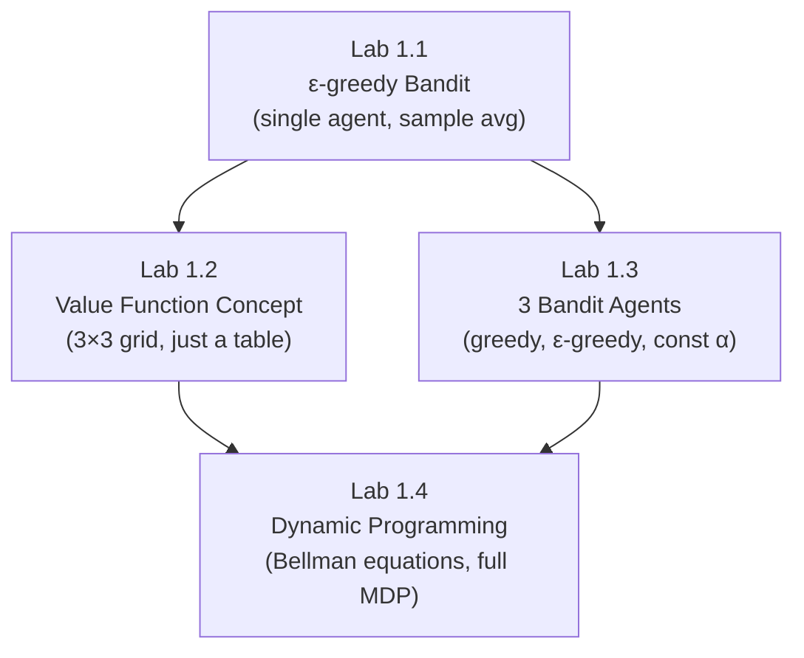

# Reinforcement Learning Labs — Complete Walkthrough

> All solutions are **barebone / rudimentary** — no optimizations, no fancy tricks, just the minimum to solve each problem.

---

## Table of Contents
1. [Lab 1.1 — Exploration & Exploitation (Epsilon-Greedy Bandit)](#lab-11)
2. [Lab 1.2 — Example of Value Function (GridWorld)](#lab-12)
3. [Lab 1.3 — Bandits & Exploration-Exploitation (RLGlue Assignment)](#lab-13)
4. [Lab 1.4 — Optimal Policies with Dynamic Programming](#lab-14)

---

## Lab 1.1 — Exploration & Exploitation (Epsilon-Greedy Bandit) {#lab-11}

### Problem Framing

> **What is this?** A 10-armed bandit. You have 10 slot machines (arms). Each arm has a hidden true mean reward `q*(a)`. You pull arms for 1000 steps and try to maximize total reward.
>
> **Core tension:** You don't know which arm is best. Do you **exploit** (pull the arm you *think* is best) or **explore** (try other arms to learn more)?

### What You Need to Know (from slides)

| Concept | Formula / Idea |
|---|---|
| **Action value** | `q*(a) = E[R_t | A_t = a]` — the true expected reward of arm `a` |
| **Estimate** | `Q_t(a) ≈ q*(a)` — our running estimate |
| **Sample-average update** | `Q_{n+1} = Q_n + (1/n) * [R_n - Q_n]` |
| **Epsilon-greedy** | With prob `ε` → pick random arm; with prob `1-ε` → pick `argmax Q` |
| **Tie-breaking** | When multiple arms share `max(Q)`, pick one at random |

### Proposed Solution

1. Create a **bandit environment** that holds `q*(a)` values drawn from `N(0,1)`.
2. Create an **agent** that keeps `Q(a)` estimates and `N(a)` counts.
3. Each step: agent selects action → env returns reward → agent updates estimate.

### Pseudo Code

```
INIT:
  q_star[0..9] ← sample from N(0,1)     # true arm values
  Q[0..9] ← 0                            # estimates
  N[0..9] ← 0                            # counts
  epsilon ← 0.1

FOR step = 1 to 1000:
  IF random() < epsilon:
    action ← random arm
  ELSE:
    action ← argmax(Q)   (break ties randomly)

  reward ← sample from N(q_star[action], 1)

  N[action] += 1
  Q[action] += (1/N[action]) * (reward - Q[action])
```

### Real Code

```python
import numpy as np

class MultiArmedBandit:
    def __init__(self, num_arms):
        self.num_arms = num_arms
        self.true_action_values = np.random.normal(0, 1, num_arms)

    def get_reward(self, action):
        return np.random.normal(self.true_action_values[action], 1.0)

class EpsilonGreedyAgent:
    def __init__(self, num_actions, epsilon=0.1):
        self.num_actions = num_actions
        self.epsilon = epsilon
        self.action_values = np.zeros(num_actions)   # Q
        self.action_counts = np.zeros(num_actions)    # N

    def select_action(self):
        if np.random.rand() < self.epsilon:
            return np.random.randint(self.num_actions)       # explore
        else:
            max_val = np.max(self.action_values)
            ties = np.where(self.action_values == max_val)[0]
            return np.random.choice(ties)                    # exploit

    def update_value(self, action, reward):
        self.action_counts[action] += 1
        alpha = 1.0 / self.action_counts[action]             # 1/N
        self.action_values[action] += alpha * (reward - self.action_values[action])

# --- run ---
np.random.seed(0)
bandit = MultiArmedBandit(10)
agent  = EpsilonGreedyAgent(10, epsilon=0.1)

for step in range(1000):
    a = agent.select_action()
    r = bandit.get_reward(a)
    agent.update_value(a, r)

print("Estimated Q:", agent.action_values)
print("True q*:    ", bandit.true_action_values)
```

> [!TIP]
> The key insight: `alpha = 1/N` is the **sample-average** step size. It makes old rewards weigh equally. For non-stationary problems, you'd use a fixed `alpha` instead (see Lab 1.3).

---

## Lab 1.2 — Example of Value Function (GridWorld) {#lab-12}

### Problem Framing

> **What is this?** A tiny 3×3 grid. Each cell is a "state." Each cell has an immediate reward (most are 0, one cell gives +1). We want a **value function** `V(s)` that tells us "how good is it to be in state s?"
>
> **This is NOT an RL algorithm.** It's just demonstrating the concept of a value table.

### What You Need to Know (from slides)

| Concept | Formula / Idea |
|---|---|
| **State** | A position `(row, col)` in the grid |
| **Reward** | `R(s)` — immediate reward for being in state `s` |
| **Value function** | `V(s)` — stores estimated "goodness" of each state |
| **MDP setup** | Agent-environment interface: states, actions, rewards, transitions |

### Proposed Solution

1. Define a 3×3 grid with rewards (only cell `(2,1)` has reward +1).
2. Create a value table `V` of same shape, initialized to 0.
3. Sweep all cells: set `V(s) = R(s)` (just copy immediate rewards as initial values).

### Pseudo Code

```
INIT:
  rewards = [[0, 0, 0],
             [0, 0, 0],
             [0, 1, 0]]
  V = [[0, 0, 0],
       [0, 0, 0],
       [0, 0, 0]]

FOR each cell (i, j):
  V[i][j] = rewards[i][j]

PRINT V
```

### Real Code

```python
import numpy as np

class GridWorld:
    def __init__(self):
        self.grid_size = (3, 3)
        self.rewards = np.array([
            [0, 0, 0],
            [0, 0, 0],
            [0, 1, 0]
        ])

    def get_reward(self, state):
        return self.rewards[state[0], state[1]]

class ValueFunction:
    def __init__(self, grid_size):
        self.values = np.zeros(grid_size)

    def update_value(self, state, new_value):
        self.values[state[0], state[1]] = new_value

    def get_value(self, state):
        return self.values[state[0], state[1]]

# --- run ---
grid_world = GridWorld()
vf = ValueFunction(grid_world.grid_size)

for i in range(3):
    for j in range(3):
        state = (i, j)
        vf.update_value(state, grid_world.get_reward(state))

print("Value Function:")
print(vf.values)
# Output: [[0. 0. 0.]
#          [0. 0. 0.]
#          [0. 1. 0.]]
```

> [!NOTE]
> This lab is purely conceptual. It shows that a value function is just a lookup table. In later labs (1.4), we use **Bellman equations** to iteratively compute *real* values (not just immediate rewards).

---

## Lab 1.3 — Bandits & Exploration-Exploitation (RLGlue Assignment) {#lab-13}

### Problem Framing

> **What is this?** Same 10-armed bandit as Lab 1.1, but now you must implement **3 different agents** inside the RLGlue framework:
>
> 1. **Greedy Agent** — always picks `argmax(Q)`, updates with `1/N`
> 2. **Epsilon-Greedy Agent** — explores with probability ε, updates with `1/N`
> 3. **Epsilon-Greedy + Constant Step-Size** — explores with probability ε, updates with fixed `α`
>
> The assignment evaluates which strategy performs best over 2000 steps.

### What You Need to Know (from slides)

| Concept | Formula / Idea |
|---|---|
| **Greedy** (`ε=0`) | Always exploit. Fast early learning if lucky, but can get stuck. |
| **ε-greedy** | Explores forever. Converges to `q*` in the limit (with `1/N`). |
| **Constant step-size** | `Q += α(R − Q)` with fixed `α`. Recent rewards weigh more. Good for non-stationary envs. |
| **Exponential recency** | `Q_{n+1} = (1−α)^n Q_1 + Σ α(1−α)^{n−i} R_i` — old rewards decay exponentially. |
| **Optimistic init** | Start `Q` at a high value (e.g., 5.0) to encourage early exploration. |
| **RLGlue interface** | `agent_init`, `agent_start`, `agent_step`, `agent_end` |

### Proposed Solution

Implement 3 classes that extend `BaseAgent` from RLGlue. Each must:
- `agent_init`: read config (num_actions, epsilon, step_size, initial_value), init Q and N.
- `agent_start`: select first action.
- `agent_step`: update Q for last action, then select next action.
- `agent_end`: update Q for final reward.

### Pseudo Code

```
CLASS GreedyAgent(BaseAgent):
  agent_init(info):
    num_actions ← info["num_actions"]
    Q ← zeros(num_actions)
    N ← zeros(num_actions)

  agent_start(obs):
    action ← argmax(Q)    # break ties randomly
    last_action ← action
    RETURN action

  agent_step(reward, obs):
    # update
    N[last_action] += 1
    Q[last_action] += (1/N[last_action]) * (reward - Q[last_action])
    # select
    action ← argmax(Q)    # break ties randomly
    last_action ← action
    RETURN action

  agent_end(reward):
    N[last_action] += 1
    Q[last_action] += (1/N[last_action]) * (reward - Q[last_action])

---

CLASS EpsilonGreedyAgent(BaseAgent):
  Same as GreedyAgent, but in select:
    if random() < epsilon:
      action ← random
    else:
      action ← argmax(Q)

---

CLASS EpsilonGreedyAgentConstantStepsize(BaseAgent):
  Same as EpsilonGreedyAgent, but in update:
    Q[last_action] += step_size * (reward - Q[last_action])
    (no N tracking needed for update)
```

### Real Code

```python
import numpy as np
from rlglue.agent import BaseAgent

# --- Helper: argmax with random tie-breaking ---
def argmax_random(q):
    max_val = np.max(q)
    ties = np.where(q == max_val)[0]
    return np.random.choice(ties)

# ============================================
# 1) Greedy Agent
# ============================================
class GreedyAgent(BaseAgent):
    def agent_init(self, agent_info={}):
        self.num_actions = agent_info.get("num_actions", 10)
        self.initial_value = agent_info.get("initial_value", 0.0)
        self.q_values = np.ones(self.num_actions) * self.initial_value
        self.arm_count = np.zeros(self.num_actions)
        self.last_action = 0

    def agent_start(self, observation):
        self.last_action = argmax_random(self.q_values)
        return self.last_action

    def agent_step(self, reward, observation):
        a = self.last_action
        self.arm_count[a] += 1
        self.q_values[a] += (1.0 / self.arm_count[a]) * (reward - self.q_values[a])
        self.last_action = argmax_random(self.q_values)
        return self.last_action

    def agent_end(self, reward):
        a = self.last_action
        self.arm_count[a] += 1
        self.q_values[a] += (1.0 / self.arm_count[a]) * (reward - self.q_values[a])

    def agent_cleanup(self): pass
    def agent_message(self, message): pass

# ============================================
# 2) Epsilon-Greedy Agent (sample average)
# ============================================
class EpsilonGreedyAgent(BaseAgent):
    def agent_init(self, agent_info={}):
        self.num_actions = agent_info.get("num_actions", 10)
        self.epsilon = agent_info.get("epsilon", 0.1)
        self.initial_value = agent_info.get("initial_value", 0.0)
        self.q_values = np.ones(self.num_actions) * self.initial_value
        self.arm_count = np.zeros(self.num_actions)
        self.last_action = 0

    def _select(self):
        if np.random.rand() < self.epsilon:
            return np.random.randint(self.num_actions)
        return argmax_random(self.q_values)

    def agent_start(self, observation):
        self.last_action = self._select()
        return self.last_action

    def agent_step(self, reward, observation):
        a = self.last_action
        self.arm_count[a] += 1
        self.q_values[a] += (1.0 / self.arm_count[a]) * (reward - self.q_values[a])
        self.last_action = self._select()
        return self.last_action

    def agent_end(self, reward):
        a = self.last_action
        self.arm_count[a] += 1
        self.q_values[a] += (1.0 / self.arm_count[a]) * (reward - self.q_values[a])

    def agent_cleanup(self): pass
    def agent_message(self, message): pass

# ============================================
# 3) Epsilon-Greedy Agent (constant step-size)
# ============================================
class EpsilonGreedyAgentConstantStepsize(BaseAgent):
    def agent_init(self, agent_info={}):
        self.num_actions = agent_info.get("num_actions", 10)
        self.epsilon = agent_info.get("epsilon", 0.1)
        self.step_size = agent_info.get("step_size", 0.1)
        self.initial_value = agent_info.get("initial_value", 0.0)
        self.q_values = np.ones(self.num_actions) * self.initial_value
        self.last_action = 0

    def _select(self):
        if np.random.rand() < self.epsilon:
            return np.random.randint(self.num_actions)
        return argmax_random(self.q_values)

    def agent_start(self, observation):
        self.last_action = self._select()
        return self.last_action

    def agent_step(self, reward, observation):
        a = self.last_action
        self.q_values[a] += self.step_size * (reward - self.q_values[a])  # fixed alpha
        self.last_action = self._select()
        return self.last_action

    def agent_end(self, reward):
        a = self.last_action
        self.q_values[a] += self.step_size * (reward - self.q_values[a])

    def agent_cleanup(self): pass
    def agent_message(self, message): pass
```

> [!IMPORTANT]
> **Key difference** between Agent 2 and Agent 3: Agent 2 uses `1/N` (sample average) — gives equal weight to all past rewards. Agent 3 uses fixed `α` — gives exponentially more weight to recent rewards. Agent 3 adapts faster when the environment changes.

---

## Lab 1.4 — Optimal Policies with Dynamic Programming {#lab-14}

### Problem Framing

> **What is this?** A ParkingWorld MDP with 11 states (`s=0..10`, where `s` = number of occupied parking spaces) and 4 actions (price levels 0..3). The environment provides full transition dynamics `p(s',r|s,a)`.
>
> You must implement 3 core DP algorithms:
> 1. **Policy Evaluation** (Bellman expectation update)
> 2. **Policy Improvement** (greedy policy w.r.t. V)
> 3. **Value Iteration** (Bellman optimality update)

### What You Need to Know (from slides)

| Concept | Formula |
|---|---|
| **Bellman expectation equation** | `V(s) = Σ_a π(a|s) Σ_{s',r} p(s',r|s,a) [r + γ·V(s')]` |
| **Policy evaluation update** | `V_{k+1}(s) ← Σ_a π(a|s) Σ_{s',r} p(s',r|s,a) [r + γ·V_k(s')]` |
| **Policy improvement** | `π'(s) = argmax_a Σ_{s',r} p(s',r|s,a) [r + γ·V(s')]` |
| **Bellman optimality equation** | `V*(s) = max_a Σ_{s',r} p(s',r|s,a) [r + γ·V*(s')]` |
| **Value iteration update** | `V_{k+1}(s) ← max_a Σ_{s',r} p(s',r|s,a) [r + γ·V_k(s')]` |
| **Discount factor γ** | Typically 0.9. Reduces weight of future rewards. |
| **Convergence** | Sweep all states; stop when `max|V_{k+1} - V_k| < θ` |

### Proposed Solution

The `ParkingWorld` environment gives us `env.transitions(s, a)` which returns a list of `(reward, probability)` tuples indexed by next state `s'`. We need 3 functions:

1. **`bellman_update(env, V, pi, s, gamma)`** — compute weighted sum over actions and transitions, update `V[s]`.
2. **`q_greedify_policy(env, V, pi, s, gamma)`** — compute `q(s,a)` for all actions, set `pi[s]` to 100% on the best action.
3. **`bellman_optimality_update(env, V, s, gamma)`** — compute `q(s,a)` for all actions, set `V[s] = max(q)`.

### Pseudo Code

```
# ----- 1. Policy Evaluation (one state update) -----
FUNCTION bellman_update(env, V, pi, s, gamma):
  total ← 0
  FOR each action a in env.A:
    pi_a ← pi[s, a]        # probability of action a under policy
    q_sa ← 0
    FOR each next_state s' in env.S:
      (r, p) ← env.transitions(s, a)[s']  # reward and probability
      q_sa += p * (r + gamma * V[s'])
    total += pi_a * q_sa
  V[s] ← total

# ----- 2. Policy Improvement (one state) -----
FUNCTION q_greedify_policy(env, V, pi, s, gamma):
  q_values ← []
  FOR each action a in env.A:
    q_sa ← 0
    FOR each next_state s' in env.S:
      (r, p) ← env.transitions(s, a)[s']
      q_sa += p * (r + gamma * V[s'])
    q_values.append(q_sa)

  best_action ← argmax(q_values)
  pi[s, :] ← 0              # zero out all action probs
  pi[s, best_action] ← 1.0  # 100% on best

# ----- 3. Value Iteration (one state update) -----
FUNCTION bellman_optimality_update(env, V, s, gamma):
  q_values ← []
  FOR each action a in env.A:
    q_sa ← 0
    FOR each next_state s' in env.S:
      (r, p) ← env.transitions(s, a)[s']
      q_sa += p * (r + gamma * V[s'])
    q_values.append(q_sa)
  V[s] ← max(q_values)
```

### Real Code

```python
import numpy as np

def bellman_update(env, V, pi, s, gamma):
    """Policy evaluation: update V[s] using Bellman expectation equation."""
    total = 0.0
    for a in env.A:
        pi_a = pi[s, a]                         # policy probability
        q_sa = 0.0
        transitions = env.transitions(s, a)      # array of [reward, prob]
        for sp in range(len(transitions)):        # sp = next state index
            r, p = transitions[sp]
            q_sa += p * (r + gamma * V[sp])
        total += pi_a * q_sa
    V[s] = total


def q_greedify_policy(env, V, pi, s, gamma):
    """Policy improvement: make pi[s] greedy w.r.t. V."""
    q_values = []
    for a in env.A:
        q_sa = 0.0
        transitions = env.transitions(s, a)
        for sp in range(len(transitions)):
            r, p = transitions[sp]
            q_sa += p * (r + gamma * V[sp])
        q_values.append(q_sa)

    best_action = np.argmax(q_values)
    pi[s] = 0.0                                   # zero all
    pi[s, best_action] = 1.0                      # greedy


def bellman_optimality_update(env, V, s, gamma):
    """Value iteration: update V[s] using Bellman optimality equation."""
    q_values = []
    for a in env.A:
        q_sa = 0.0
        transitions = env.transitions(s, a)
        for sp in range(len(transitions)):
            r, p = transitions[sp]
            q_sa += p * (r + gamma * V[sp])
        q_values.append(q_sa)
    V[s] = max(q_values)
```

#### How These Are Used (the outer loops):

```python
# --- Policy Evaluation (full sweep until convergence) ---
def policy_evaluation(env, V, pi, gamma, theta=1e-10):
    while True:
        delta = 0
        for s in env.S:
            v_old = V[s]
            bellman_update(env, V, pi, s, gamma)
            delta = max(delta, abs(V[s] - v_old))
        if delta < theta:
            break

# --- Policy Iteration (alternate eval + improve until stable) ---
def policy_iteration(env, V, pi, gamma, theta=1e-10):
    stable = False
    while not stable:
        # 1. evaluate
        policy_evaluation(env, V, pi, gamma, theta)
        # 2. improve
        stable = True
        for s in env.S:
            old_action = np.argmax(pi[s])
            q_greedify_policy(env, V, pi, s, gamma)
            if np.argmax(pi[s]) != old_action:
                stable = False

# --- Value Iteration (single combined sweep) ---
def value_iteration(env, V, gamma, theta=1e-10):
    while True:
        delta = 0
        for s in env.S:
            v_old = V[s]
            bellman_optimality_update(env, V, s, gamma)
            delta = max(delta, abs(V[s] - v_old))
        if delta < theta:
            break
```

> [!IMPORTANT]
> **Policy Evaluation** computes `V` for a *fixed* policy. **Policy Improvement** takes that `V` and makes the policy greedy. **Policy Iteration** alternates these two until the policy doesn't change. **Value Iteration** combines both into a single max-based update, skipping the explicit policy step.

---

## Summary: How the Labs Build on Each Other



| Lab | Core Concept | Key Formula |
|---|---|---|
| 1.1 | ε-greedy exploration | `Q += (1/N)(R − Q)` |
| 1.2 | Value function = lookup table | `V(s) = R(s)` (init only) |
| 1.3 | Compare 3 agent strategies | `Q += α(R − Q)` vs `Q += (1/N)(R − Q)` |
| 1.4 | DP: full MDP solution | `V(s) = Σ π(a|s) Σ p(s',r|s,a)[r + γV(s')]` |
